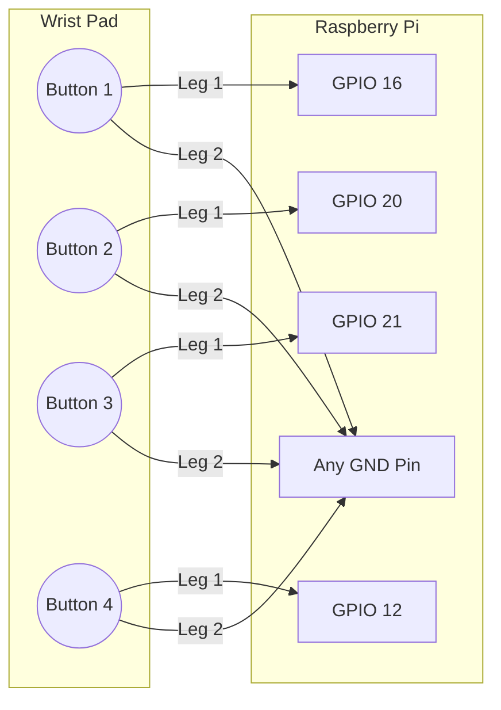
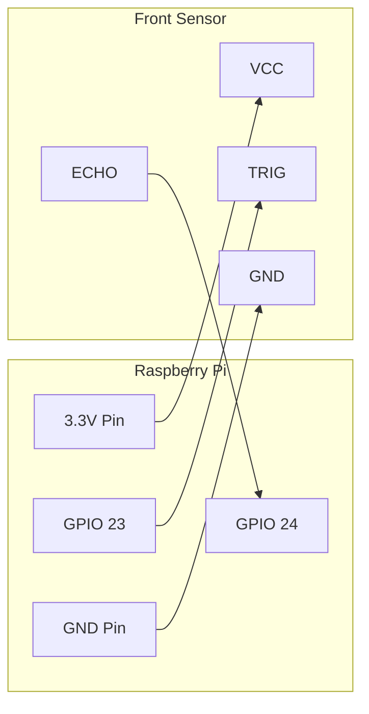

# 🔧 Step-by-Step Hardware Assembly Guide

Welcome to the wiring portion of the Blind Assist Hat! This process is simple.

---

## Step 1: Connecting the Camera & Speaker
1. **The Camera**: Insert the camera ribbon cable straight into the `CSI` port.
2. **The Speaker**: Plug directly into the Raspberry Pi's **3.5mm audio jack**.

---

## Step 2: Wiring the Wrist Buttons
Connect each button bridging between a GPIO pin and Ground.

---

## Step 3: Wiring the Ultrasonic Sensors

Since your specific HC-SR04 sensors are compatible with **3.3 Volts**, they can wire perfectly directly to the Raspberry Pi without any external voltage dividers!

### Ultrasonic Sensor Front Connections
| Pin | Connection |
| :--- | :--- |
| VCC | 3.3V |
| Trig | GPIO 23 |
| Echo | GPIO 24 |
| GND | GND |

### Ultrasonic Sensor Left Connections
| Pin | Connection |
| :--- | :--- |
| VCC | 3.3V |
| Trig | GPIO 17 |
| Echo | GPIO 27 |
| GND | GND |

### Ultrasonic Sensor Right Connections
| Pin | Connection |
| :--- | :--- |
| VCC | 3.3V |
| Trig | GPIO 5 |
| Echo | GPIO 6 |
| GND | GND |

### Diagram Example (Front Sensor)

