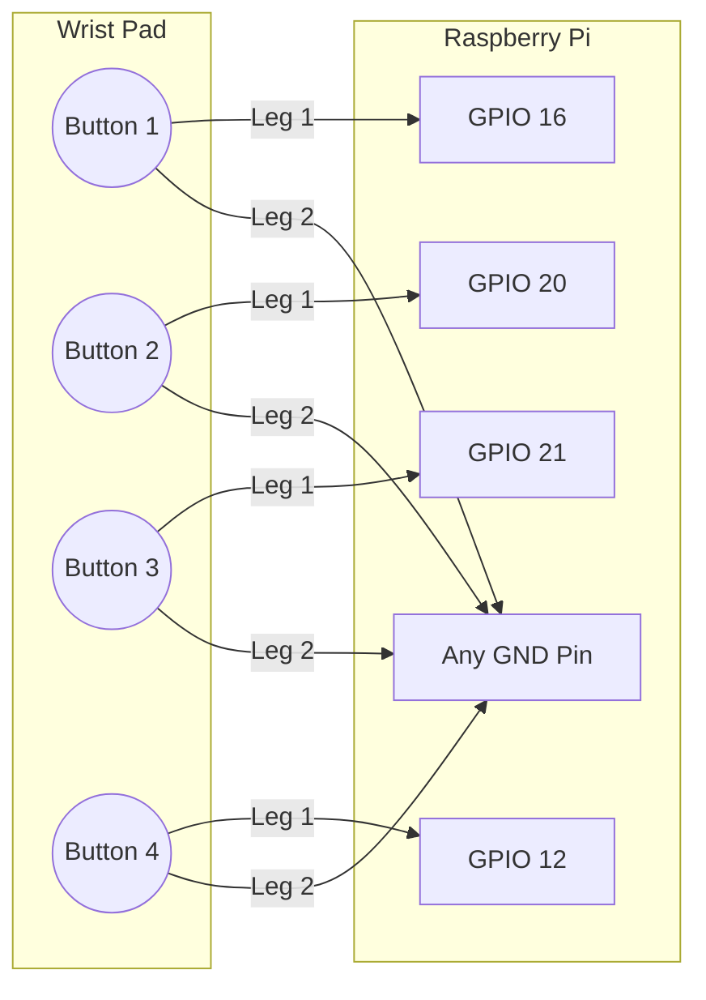
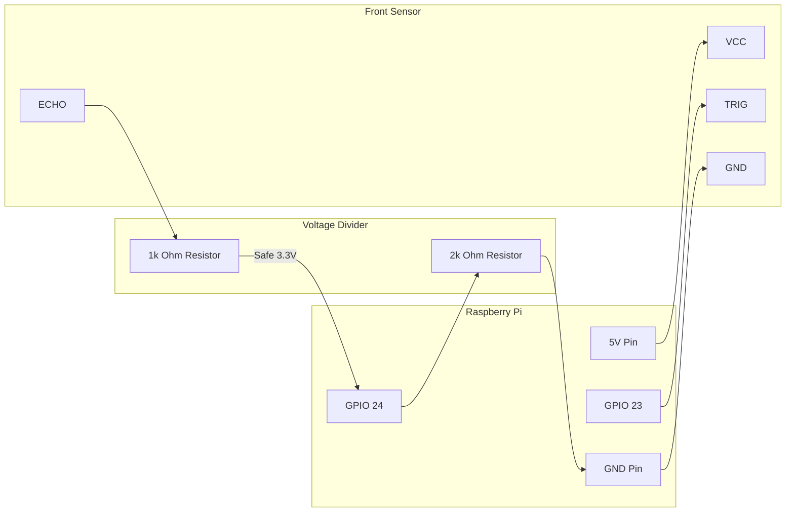

# 🔧 Step-by-Step Hardware Assembly Guide

Welcome to the wiring portion of the Blind Assist Hat! This process is simple. You will connect three main components to your Raspberry Pi: **The Ultrasonic Sensors**, **The Wrist Buttons**, and **The Camera/Speaker**.

---

## Step 1: Connecting the Camera & Speaker
These are the easiest parts because they plug right into built-in ports safely!

1. **The Camera**: Find the long, thin slot on your Raspberry Pi labeled `CAMERA` or `CSI`. Gently lift the plastic lock, insert the camera ribbon cable (with the shiny silver contacts facing away from the ethernet port), and push the lock back down.
2. **The Speaker**: Simply plug your headphones or mini-speaker directly into the Raspberry Pi's **3.5mm audio jack**.

---

## Step 2: Wiring the Wrist Buttons
You will connect four simple push-buttons to the Pi. Since the Pi has "invisible" internal resistors that we activate in our Python code, wiring these is extremely safe and easy. 

- Connect **one leg** of every button to the same **Ground (GND)** pin on the Pi.
- Connect the **other leg** of each button directly to its specific GPIO data pin.

---

## Step 3: Wiring the Ultrasonic Sensors
This step requires extreme care. The sensors (HC-SR04) use **5 Volts** of power, but the Pi's data pins can only safely handle **3.3 Volts**. If you send 5V straight into a GPIO data pin, it will damage your Pi! 

To fix this, we use a **Voltage Divider** (using standard resistors) to cleanly lower the voltage returning from the sensor's `Echo` pin before it impacts the Pi.

### How to wire ONE sensor (Repeat this for all three):
- **VCC:** Connect to a **5V Pin** on the Pi.
- **GND:** Connect to a **GND Pin** on the Pi.
- **Trig:** Connect directly to the designated **GPIO Pin** (The Pi outputting 3.3V is enough to trigger the sensor).
- **Echo:** Connect through a `1kΩ` and `2kΩ` resistor divider before plugging into the Pi.

### The Voltage Divider Diagram
Connect the Echo pin to a `1kΩ` resistor. From there, split the path: one line goes precisely into the Pi's GPIO pin, and the other line goes through a `2kΩ` resistor straight to the Ground (GND).

### The Exact Pin Layout
Apply the safe wiring diagram above to the three sensors exactly as follows:

| Sensor | Trig Pin | Echo Pin (Requires Resistors!) |
| :--- | :--- | :--- |
| **Front Sensor** | GPIO 23 | GPIO 24 |
| **Left Sensor** | GPIO 17 | GPIO 27 |
| **Right Sensor** | GPIO 5 | GPIO 6 |

---

**And that's it!** Once the wires are secured (ideally using a breadboard or soldered onto a protoboard), your hardware is fully configured.
